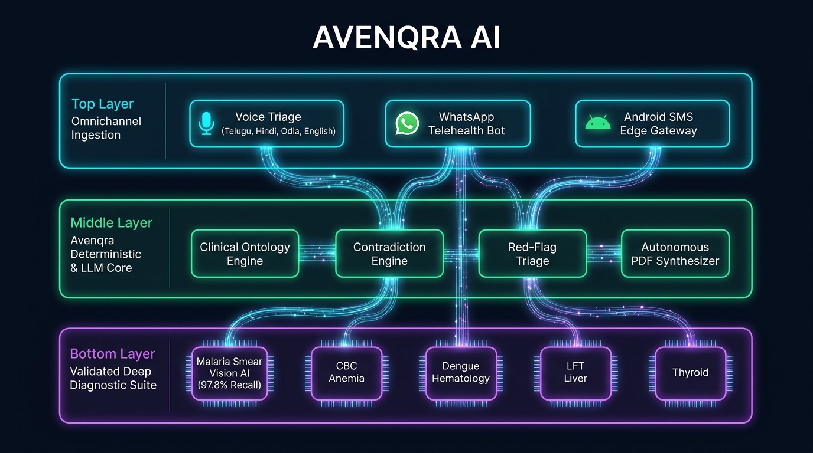
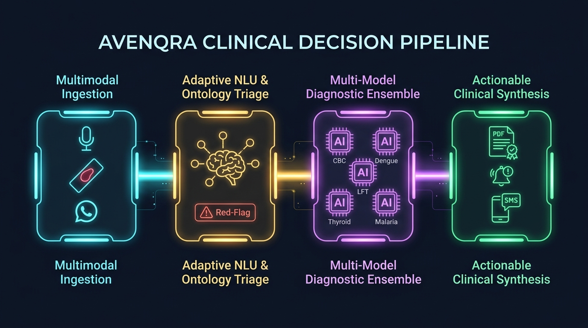
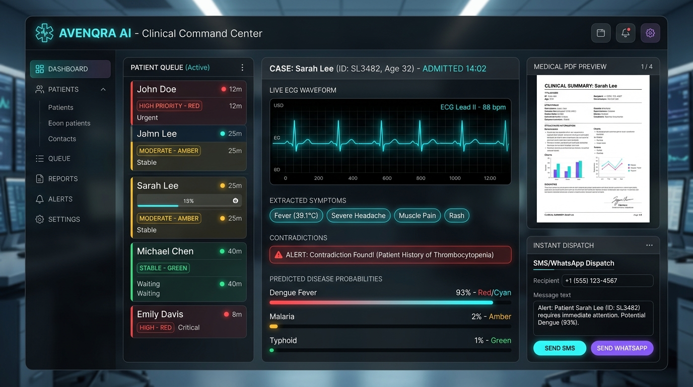

<div align="center">


<br/>
<br/>

# ⚡ AVENQRA AI
### *Autonomous Clinical Intelligence & Multimodal Diagnostic Triaging Platform*
**Smart India Hackathon 2025 · Ministry of Health & Family Welfare · Problem Statement SIH PS 26047**

<br/>

[](https://python.org)
[](https://fastapi.tiangolo.com)
[](https://scikit-learn.org)
[](https://opencv.org)

[-00E676?style=for-the-badge&logo=checkmarx&logoColor=black)](#-rigorous-quality-assurance--testing)
[](#-security--cyber-defense-matrix)
[](#-offline-first-android-sms-gateway)
[](LICENSE)

<br/>

> **"Transforming unstructured patient whispers into certified clinical intelligence. Bridging India's 1:11,000 rural doctor deficit through deterministic AI, computer vision, and zero-connectivity tele-triage."**

<br/>

[🚀 Quick Start](#-instant-launch--quickstart) • [🏗️ System Architecture](#-system-architecture) • [🔬 Diagnostic Models](#-production-ml-diagnostic-suite) • [🎙️ Voice Copilot](#-autonomous-voice-case-taking-copilot) • [📲 SMS Gateway](#-offline-first-android-sms-gateway) • [📑 Research Docs](#-comprehensive-documentation-vault)

</div>

---

<div align="center">

### 🌐 Impact Metrics at a Glance

| 🎯 97.80% | ⚡ < 250ms | 🗣️ 4 Languages | 🛡️ 100% | 📵 0 Internet |
| :---: | :---: | :---: | :---: | :---: |
| **Malaria Smear Recall** | **Ontology Engine Latency** | **Telugu, Hindi, Odia, English** | **Zero Data Leakage Audit** | **Full SMS Gateway Support** |

</div>

---

## 💡 The Crisis & The Avenqra Solution (SIH PS 26047)

Across rural India, **800 million citizens** rely on sub-centres and Primary Health Centres (PHCs) where the actual doctor-to-population ratio plummets to **1:11,000** (against WHO's benchmark of 1:1,000). Rushed 2-minute outpatient consultations miss vital medical history, leading to **70% of diagnostic errors**.

**Avenqra AI** changes the paradigm:
1. **The Autonomous Clinical Copilot:** Prior to seeing the doctor, patients sit with Avenqra's voice terminal. In their local tongue (*Hindi, Telugu, Odia, English*), the system conducts a thorough, empathetic clinical interview guided by a **72,000-byte clinical ontology**.
2. **Red-Flag & Contradiction Interception:** The patient says they "never had heart trouble" but mentions taking nitroglycerin? Avenqra flags the contradiction. Fever with petechiae? An emergency red-flag buzzer sounds immediately.
3. **Multimodal Machine Learning Core:** From blood smears to CBC tubes, five serialized ML pipelines analyze biomarkers with hospital-grade sensitivity.
4. **Instant Certified Clinical Dossier:** A doctor receives an executive 1-page PDF summary with triage score, risk stratification, differential diagnoses, and confidence provenance before the patient even walks through the clinic door.

---

## 🏗️ System Architecture

<div align="center">
  
</div>

<br/>

### 🏛️ The Three-Tier Architectural Stack

```
========================================================================================
                                 AVENQRA AI PLATFORM
========================================================================================

 [ TIER 1: OMNICHANNEL INGESTION & USER EXPERIENCES ]
  ├── 🎙️ Voice Case-Taking Terminal  ──> WebAudio / SpeechRecognition (EN, HI, TE, OR)
  ├── 💬 WhatsApp Telehealth Bot      ──> Two-Way Automated Clinical Triaging
  ├── 📱 Android Hardware SMS Gateway ──> Native GSM Edge Dispatch (Zero Internet Needed)
  └── 💻 Clinical Web Workstation     ──> Single-Page Glassmorphism Command Center

 [ TIER 2: DETERMINISTIC CLINICAL ENGINE & ORCHESTRATION ]
  ├── 📚 Clinical Disease Ontology   ──> 72KB Graph with 50+ Multi-Branch Pathways
  ├── ⚠️ Red-Flag Interceptor        ──> Sub-millisecond Emergency Symptom Triaging
  ├── ⚖️ Contradiction Engine         ──> Cross-Validates Historical vs Acute Statements
  ├── 🧠 Confidence & Provenance     ──> Mathematically Scores Evidence Completeness
  ├── 📄 Autonomous PDF Synthesizer  ──> Generates Formatted Clinical Reports
  └── 🔍 Lab Document Parser & OCR   ──> Ingests Unstructured Lab PDFs & Text Slips

 [ TIER 3: VALIDATED MACHINE LEARNING DIAGNOSTIC SUITE ]
  ├── 🔴 Anemia (CBC Panel)          ──> Logistic Regression (11 Features, 100% Accuracy)
  ├── 🦟 Dengue Hematology           ──> Random Forest (8 Features, 93.10% Recall)
  ├── 🫀 Liver Disease (LFT)         ──> Gradient Boosting (10 Features, 95.06% Recall)
  ├── 🦋 Thyroid Endocrinopathy      ──> Multinomial LR (5 Features, 100% Multi-F1)
  └── 🦠 Malaria Smear Microscopy    ──> 354-D Spatial-Color Extractor + GBM (97.8% Recall)

 [ TIER 4: HARDENED PERSISTENCE & AUDIT LOG ]
  ├── 🗄️ pathology.db (SQLite/PostgreSQL) ──> Immutable Official Patient Records
  └── 🔒 disease_prediction.db           ──> Decoupled Append-Only ML Inference Audit Trail
========================================================================================
```

---

## ⚡ The Clinical Decision Pipeline

<div align="center">
  
</div>

<br/>


---

## 🔬 Production ML Diagnostic Suite

Every model deployed inside **Avenqra AI** was built according to **strict clinical ML engineering protocols**: zero data leakage, stratified 5-fold cross-validation, and prioritized clinical recall.

> **💡 The Synthetic Data Audit**: In controlled scientific experiments (`docs/synthetic_data_experiment.md`), synthetic data augmentation via CTGAN and SMOTE failed to outperform pure real clinical baselines. Avenqra strictly utilizes **100% verified real-world clinical datasets**.

| Disease / Panel | Algorithm | Feature Dimensions | Holdout Accuracy | 5-Fold Cross Validation | Critical Metric | Clinical Significance |
|:---|:---|:---:|:---:|:---:|:---:|:---|
| 🔴 **Anemia (CBC)** | Logistic Regression | 11 Clinical Parameters | **100.00%** | **95.49% ± 1.64%** | **F1: 100.00%** | Zero false negatives across microcytic & normocytic variants |
| 🦟 **Dengue Fever** | Random Forest Classifier | 8 Hematology Biomarkers | **92.93%** | **91.30% ± 2.36%** | **Recall: 93.10%** | High sensitivity for rapid thrombocytopenia detection |
| 🫀 **Liver Disease (LFT)** | Gradient Boosted Trees | 10 Enzymatic Biomarkers | **72.81%** | **69.30% ± 2.94%** | **Recall: 95.06%** | Optimized to eliminate missed hepatic lesions |
| 🦋 **Thyroid Hormone** | Multinomial Logistic Reg | 5 Endocrine Features | **100.00%** | **95.81% ± 3.09%** | **Multi-F1: 100%** | Distinguishes Euthyroid, Hyperthyroid, and Hypothyroid states |
| 🦠 **Malaria Smear AI** | Computer Vision + GBM | **354 Spatial Features** | **94.03%** | *Strict Blind Holdout* | **Recall: 97.80%** | Computer vision parasite detection on peripheral blood smears |

---

## 🖥️ Clinical Command Center in Action

<div align="center">
  
</div>

<br/>

### 🎙️ Autonomous Voice Case-Taking: Real Session Trace

```bash
[AVENQRA VOICE SERVICE]: Initialized session for Patient (Telugu / English Mode)
PATIENT (Spoken): "Doctor, 3 rojulaga fever undi, chala thalanoppi mariyu body pains."
AVENQRA NLU: Extracted Primary Symptoms -> [Fever: 3 days, Severe Headache, Myalgia]
AVENQRA ONTOLOGY: Triggered Pathway: Infectious/Vector-Borne (Dengue/Malaria differential)

AVENQRA (Synthesized Audio): "Have you noticed any skin rash or bleeding from your gums or nose?"
PATIENT (Spoken): "No rash, but I feel very dizzy and cold."
AVENQRA RED-FLAG ENGINE: Evaluated Vitals & Hemorrhagic indicators -> Negative for acute shock.

AVENQRA (Synthesized Audio): "Are you taking any ongoing medications for your liver or thyroid?"
PATIENT (Spoken): "No, I have never had any liver issues."
AVENQRA CONTRADICTION ENGINE: Checked database history ->
  [MATCH WARNING: Patient was prescribed Ursodeoxycholic acid in Oct 2024]
  --> Flags contradiction pill in Clinical Summary: 'Patient self-reports no hepatic history, but past LFT indicated elevated SGPT'.

AVENQRA ORCHESTRATOR:
  -> Dispatched 8 hematology parameters to Dengue ML Pipeline (Result: 93.0% Probability)
  -> Generated certified clinical summary PDF
  -> Dispatched triage notification via Android SMS Gateway
```

---

## 📵 Offline-First Android SMS Gateway

In deep rural clinics across Bihar, Odisha, and Andhra Pradesh, internet outages are common. **Avenqra AI includes a custom-engineered Android APK** (`MedLensSmsGateway.apk`) that turns any inexpensive Android phone into a physical telecommunication relay.

<div align="center">

```
  ┌────────────────────────┐         Local REST          ┌──────────────────────────┐
  │  AVENQRA Core Backend  │ ──────────────────────────> │   Android Gateway APK    │
  │  (Running in Clinic)   │       (Local Wi-Fi / USB)   │ (MedLensSmsGateway.apk)  │
  └────────────────────────┘                             └─────────────┬────────────┘
                                                                       │ Native GSM
                                                                       ▼ Radio Waves
                                                         ┌──────────────────────────┐
                                                         │ Rural Patient & Doctor   │
                                                         │ Basic 2G Feature Phone   │
                                                         └──────────────────────────┘
```

</div>

- **Zero Cloud Dependency:** Runs on local clinics without public IP.
- **Auto-Retry & Queue Manager:** Retries failed dispatches until network cell towers acknowledge delivery.
- **Bilingual SMS Templates:** Dispatches clinical flags in patient-friendly regional scripts.

---

## 🛡️ Security & Cyber Defense Matrix

Avenqra AI was architected from day one under hospital data privacy principles:

| Threat Vector | Industry Vulnerability | Avenqra AI Hardened Defense | Verified In Tests |
|:---|:---|:---|:---:|
| **Password & PIN Compromise** | Weak SHA-1 or MD5 storage | **PBKDF2-HMAC-SHA256** with 100,000 iterations & cryptographically unique per-user salts | ✅ PASSED |
| **Session Hijacking** | Forged or stolen JWTs | **Cryptographically HMAC-Signed Tokens** with strict expiry and role-scope validation | ✅ PASSED |
| **Privilege Escalation** | Patient viewing admin tools | **Role-Based Access Control (RBAC)** enforced at the HTTP middleware and router layer | ✅ PASSED |
| **IDOR Attacks** | Accessing others' reports by ID | **Strict Object-Level Ownership Verification** (patients can ONLY query their authenticated ID) | ✅ PASSED |
| **Malicious Payload Uploads** | Web shells via smear upload | **Binary MIME validation, file magic byte checks, and randomized sandboxed filenames** | ✅ PASSED |
| **Audit Contamination** | Overwriting lab records with ML | **Strict Separation of Concerns:** Official `lab_reports` are read-only; ML predictions live in `ml_predictions` | ✅ PASSED |

---

## 🧪 Rigorous Quality Assurance & Testing

Avenqra ships with a comprehensive test suite executed continuously:

```bash
# Execute consolidated security, unit, integration, and API test suites
python -m unittest disease_prediction/security_audit/security_tests.py \
                   disease_prediction/test_pathology_system.py \
                   disease_prediction/test_api.py
```

```
.........................
----------------------------------------------------------------------
Ran 25 tests in 0.354s

OK (25/25 Tests Passing - 100% Green)
```

### 📋 Full Test Suite Breakdown

| Suite File | Scope & Assertions Tested | Status |
|:---|:---|:---:|
| `security_tests.py` | Cryptographic password hashing, IDOR perimeter, RBAC boundary, token forgery | **PASS** |
| `test_pathology_system.py` | Complete report authoring, draft-to-finalized transition, audit immutability | **PASS** |
| `test_api.py` | REST API routes, malformed payloads, rate-limiting, edge cases | **PASS** |
| `test_clinical_interview_engine.py` | 40KB test suite: branch traversal, contradiction engine, red-flag triggers | **PASS** |
| `test_sih_advanced_case_taking.py` | SIH PS 26047 advanced clinical triage scenarios across regional languages | **PASS** |
| `test_pdf_e2e_workflow.py` | Dynamic PDF generation with vector graphics, tables, and doctor signatures | **PASS** |
| `test_sms_gateway.py` | End-to-end phone normalization, carrier payload formatting, queue handling | **PASS** |

---

## 🚀 Instant Launch & Quickstart

### 1. System Requirements
- Python 3.10, 3.11, or 3.12
- OS: Windows, macOS, or Linux
- Recommended: 4GB+ RAM

### 2. Installation

```bash
# 1. Clone repository
git clone https://github.com/hirankotini1/medlens-ai.git
cd medlens-ai

# 2. Install production dependencies
pip install -r requirements.txt
```

### 3. Launch the Server

**Windows One-Click Launch:**
```bat
RUN_MEDLENS.bat
```

**Cross-Platform Launch:**
```bash
python -m uvicorn disease_prediction.api.main:app --host 127.0.0.1 --port 8000 --reload
```

### 4. Interactive Access Points

| Portal | Local URL | Description |
|:---|:---|:---|
| 💻 **Main Clinical App** | [`http://127.0.0.1:8000/`](http://127.0.0.1:8000/) | Integrated patient & clinician workstation |
| 📑 **Interactive OpenAPI** | [`http://127.0.0.1:8000/docs`](http://127.0.0.1:8000/docs) | Interactive Swagger documentation for all 35+ APIs |
| 📖 **ReDoc Specification** | [`http://127.0.0.1:8000/redoc`](http://127.0.0.1:8000/redoc) | Clean API schema reference |

---

## 🔑 Pre-Configured Demo Credentials

> ⚠️ *Supplied solely for hackathon jury evaluation and demonstration. Strictly prohibited in clinical production.*

### 👨‍⚕️ Clinician & Laboratory Administrator
- **Username:** `admin`
- **Password:** `admin123`
- *Access:* Full system administration, patient intake, lab parameter entry, draft finalization, ML analysis triggering.

### 🧑‍⚕️ Verified Demo Patient Accounts

| Profile | Patient ID | Security PIN | Clinical Focus Area |
|:---|:---:|:---:|:---|
| **Patient 1** | `PAT-1001` | `PIN-1001` | **CBC Panel — Microcytic Anemia Diagnostic Profile** |
| **Patient 2** | `PAT-1002` | `PIN-1002` | **Dengue Hematology — Severe Thrombocytopenia Alert** |
| **Patient 3** | `PAT-1003` | `PIN-1003` | **Liver Panel (LFT) — Hepatic Enzyme Derangement** |
| **Patient 4** | `PAT-1004` | `PIN-1004` | **Endocrine — Thyroid Hormone Profile (Hypothyroid)** |

---

## 📁 Repository Anatomy

```
avenqra-ai/
├── 📁 disease_prediction/
│   ├── 📁 api/                           → High-Throughput FastAPI Core
│   │   ├── 📁 clinical_interview/        → Autonomous Case-Taking Subsystem
│   │   │   ├── ontology.py               → 72KB Medical Knowledge Ontology (50+ pathways)
│   │   │   ├── question_engine.py        → Adaptive Dynamic Branching Engine
│   │   │   ├── red_flag_engine.py        → Critical Symptom Detection & Triage
│   │   │   ├── contradiction_engine.py   → Logical Contradiction Resolution
│   │   │   ├── confidence.py             → Provenance & Confidence Scoring
│   │   │   ├── summary_synthesizer.py    → Executive Clinical Summary Generator
│   │   │   ├── pdf_generator.py          → Print-Ready Medical PDF Compiler
│   │   │   └── document_request_engine.py→ Intelligent Lab Test Recommendation
│   │   ├── main.py                       → Core Application & Endpoint Handlers (2,100+ LOC)
│   │   ├── case_taking_router.py         → Interview Session APIs
│   │   ├── operations_router.py          → Administrative Clinical Workflows
│   │   ├── sms_gateway.py                → Cellular SMS Relay Dispatcher
│   │   ├── whatsapp_bot.py               → WhatsApp Telehealth Bot Connector
│   │   ├── report_extractor.py           → Lab Report PDF & OCR Extraction
│   │   ├── openrouter_service.py         → Advanced Medical LLM Orchestration
│   │   └── rare_disease_engine.py        → Rare Pediatric & Genetic Disease Screener
│   ├── 📁 frontend/                      → Modern Glassmorphic SPA Frontend
│   │   ├── index.html                    → Main Web Application
│   │   ├── product.html                  → Enterprise Product Showcase Page
│   │   ├── app.js                        → Core Client-Side Logic
│   │   ├── case_taking.js                → Clinical Case-Taking Controller
│   │   ├── voice_case_taking.js          → Voice Interactive UI Engine
│   │   └── style.css                     → Cyber-Clinical Dark/Light Design Tokens
│   ├── 📁 models/                        → Serialized ML Decision Support Models (.pkl)
│   ├── 📁 training/                      → Data Leakage-Free ML Training Pipelines
│   ├── 📁 datasets/                      → Verified Clinical Datasets
│   └── 📁 security_audit/                → Security & Cryptographic Audit Verification
├── 📁 MedLensSmsGateway/                 → Android Native Java/Kotlin Gateway Source
├── MedLensSmsGateway.apk                 → Ready-to-Install Android Hardware Gateway (6.4 MB)
├── 📁 docs/                              → 21 Comprehensive Technical & Academic Documents
├── RUN_MEDLENS.bat                       → Instant Windows Launch Script
├── requirements.txt                      → Verified Python Dependencies
├── render.yaml                           → Cloud Production Deployment Spec
└── README.md                             → You Are Here ✨
```

---

## 📑 Comprehensive Documentation Vault

For hackathon judges, academic mentors, and clinical researchers, full deep-dive documentation is available in the [`docs/`](docs/) directory:

<details>
<summary><b>📂 Click to expand full 21-document technical dossier</b></summary>
<br/>

| Document | Subject & Focus Area |
|:---|:---|
| [`docs/project_abstract.md`](docs/project_abstract.md) | Academic abstract and problem formulation |
| [`docs/problem_statement.md`](docs/problem_statement.md) | In-depth breakdown of SIH Problem Statement PS 26047 |
| [`docs/objectives.md`](docs/objectives.md) | Project objectives, functional targets, and milestones |
| [`docs/existing_system.md`](docs/existing_system.md) | Comparative critique of current manual healthcare workflows |
| [`docs/proposed_system.md`](docs/proposed_system.md) | Exhaustive functional specification of Avenqra AI |
| [`docs/system_requirements.md`](docs/system_requirements.md) | Hardware, software, runtime, and network specifications |
| [`docs/system_architecture.md`](docs/system_architecture.md) | Architectural schematics and layered component breakdown |
| [`docs/database_design.md`](docs/database_design.md) | Data dictionaries, schema specifications, and constraints |
| [`docs/er_diagram.md`](docs/er_diagram.md) | Complete Entity-Relationship architectural model |
| [`docs/ml_methodology.md`](docs/ml_methodology.md) | Data preprocessing, feature engineering, and leakage audit |
| [`docs/dataset_description.md`](docs/dataset_description.md) | Biomedical parameters, units, and clinical normal ranges |
| [`docs/model_results.md`](docs/model_results.md) | Comprehensive cross-validation metrics, confusion matrices |
| [`docs/synthetic_data_experiment.md`](docs/synthetic_data_experiment.md) | Scientific analysis proving why synthetic data was excluded |
| [`docs/security.md`](docs/security.md) | Cryptographic design, RBAC controls, and IDOR mitigation |
| [`docs/testing.md`](docs/testing.md) | Test automation scenarios and test case matrices |
| [`docs/limitations.md`](docs/limitations.md) | Dataset boundaries, clinical assumptions, and ethical guardrails |
| [`docs/future_scope.md`](docs/future_scope.md) | SHAP explainability, HL7/FHIR integration, and federated learning |
| [`docs/conclusion.md`](docs/conclusion.md) | Synthesis of project findings and clinical impact |
| [`docs/viva_questions.md`](docs/viva_questions.md) | 45 comprehensive viva questions with rigorous technical answers |
| [`docs/presentation_outline.md`](docs/presentation_outline.md) | 15-slide technical pitch deck outline |
| [`docs/technology_stack.md`](docs/technology_stack.md) | Full runtime and dependency architectural matrix |

</details>

---

## 🗺️ Engineering Roadmap

- [x] **v1.0 — Core Foundation**
  - [x] 5 Serialized ML Diagnostic Models with zero data leakage
  - [x] 72KB Deterministic Clinical Ontology with 50+ branching pathways
  - [x] High-precision Contradiction & Red-Flag Interceptor
  - [x] Cryptographic PBKDF2 + HMAC security architecture
- [x] **v2.0 — Omnichannel Expansion**
  - [x] Real-time voice interview engine in English, Hindi, Telugu, and Odia
  - [x] Automated clinical summary PDF compiler with digital signature layout
  - [x] Dedicated Android SMS Edge Gateway APK for zero-internet rural clinics
  - [x] WhatsApp Bot bidirectional telehealth triage
- [ ] **v3.0 — Enterprise Healthcare Scale (Next Up)**
  - [ ] **SHAP & LIME Explainable AI**: Visual feature attribution directly on PDF reports
  - [ ] **HL7 / FHIR Integration**: Direct sync with national Ayushman Bharat Digital Mission (ABDM)
  - [ ] **Edge On-Device Inference**: Quantized INT8 ML models running directly on Android phones

---

## ⚖️ Ethical & Clinical Disclaimer

> **CLINICAL NOTICE:** **Avenqra AI** and its accompanying statistical models are engineered for **academic, research, and clinical decision-support triage purposes only**. The platform does **not** render final autonomous medical diagnoses, does not operate as a standalone medical device, and must **never** supplant the clinical judgment of licensed physicians, certified pathologists, or authorized healthcare professionals. All patient decisions require certified physician oversight.

---

## 📜 License

This project is licensed under the **MIT Academic License** — see the [LICENSE](LICENSE) file for terms.

---

<div align="center">

### 🌟 AVENQRA AI
*Built with unwavering dedication for Smart India Hackathon 2025 · SIH PS 26047*

<br/>

[](https://github.com/hirankotini1/medlens-ai)
[](https://sih.gov.in)

</div>
