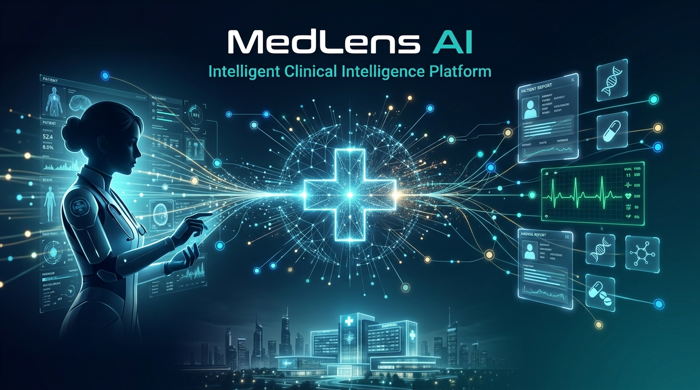
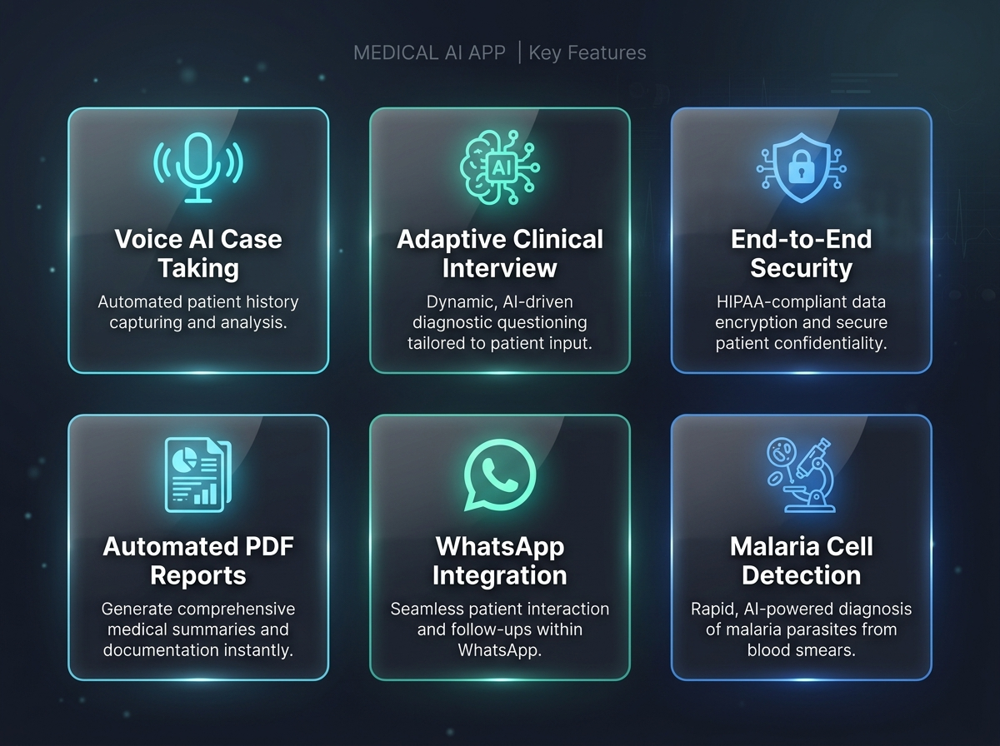
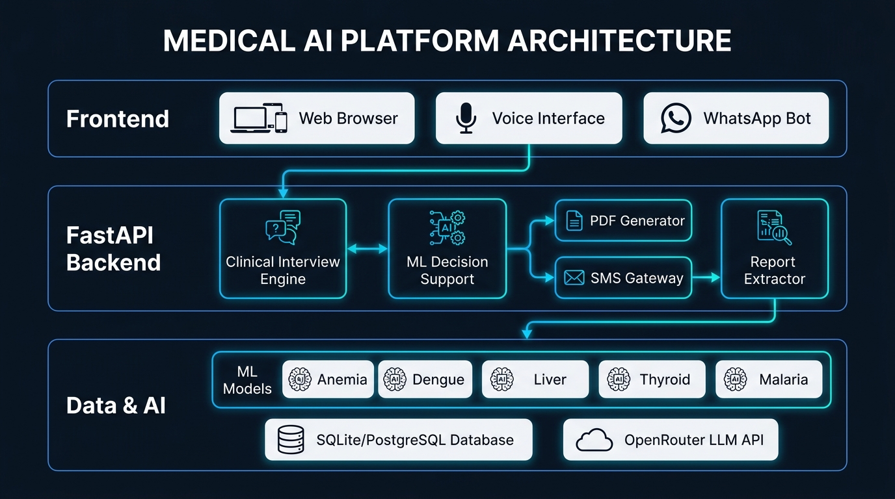

<div align="center">



<br/>

# 🏥 MedLens AI — *Where Intelligence Meets Healthcare*

### **Smart India Hackathon 2025 · Problem Statement SIH PS 26047**

<br/>

[](https://python.org)
[](https://fastapi.tiangolo.com)
[](https://scikit-learn.org)
[](https://opencv.org)

[](#-testing--quality-assurance)
[](#-security--compliance)
[](LICENSE)
[](#-sms-gateway--android-app)

<br/>

> **"From a patient's whispered complaint to a validated clinical summary — powered by AI, secured by design, built for India."**

<br/>

[🚀 Quick Start](#-quick-start) · [✨ Features](#-core-features) · [🧠 AI Models](#-ai-powered-diagnostic-models) · [🏗️ Architecture](#-system-architecture) · [📱 Demo](#-live-demo)

</div>

---

## 🌟 What is MedLens AI?

**MedLens AI** is a full-stack, AI-powered clinical intelligence platform designed to revolutionize patient case-taking and disease prediction in resource-constrained healthcare environments across India. Built for **SIH 2025**, MedLens bridges the gap between modern clinical intelligence and frontline healthcare workers.

It combines:
- 🎙️ **Voice-driven AI clinical interviews** that adaptively gather patient history
- 🧬 **5 validated ML diagnostic pipelines** across critical disease domains
- 📄 **Automated PDF clinical summaries** sent securely to doctors & patients
- 💬 **WhatsApp Bot integration** for rural outreach and follow-up
- 🔒 **Military-grade security** with PBKDF2, HMAC, RBAC, and IDOR protection

---

## ✨ Core Features



<br/>

### 🎙️ Voice AI Case Taking Engine
An adaptive, multilingual conversational agent that conducts structured patient interviews — asking the right follow-up questions intelligently based on the patient's symptoms, history, and responses.

- Real-time **speech-to-text** with `SpeechRecognition`
- Multilingual support including **Hindi, Telugu, Odia**, and English
- Detects **red flags** (critical symptoms) and escalates automatically
- Tracks answer **provenance** and **contradiction detection**
- Outputs a structured clinical summary ready for doctor review

### 🧠 Adaptive Clinical Interview Engine
At the heart of MedLens is a fully deterministic, ontology-driven clinical engine:

| Module | Capability |
|--------|-----------|
| `ontology.py` | 72,000+ byte clinical disease ontology with 50+ pathways |
| `question_engine.py` | Dynamic, branching questionnaire generation |
| `red_flag_engine.py` | Real-time critical symptom detection |
| `contradiction_engine.py` | Cross-checks patient answers for inconsistencies |
| `confidence.py` | Calculates answer confidence scores per parameter |
| `summary_synthesizer.py` | Generates structured clinical summaries |
| `pdf_generator.py` | Produces professional clinical PDF reports |
| `document_request_engine.py` | Intelligently requests lab documents |

### 📊 5 Validated ML Diagnostic Pipelines
Production-grade models trained with strict data-leakage prevention and 5-fold cross-validation.

### 📱 WhatsApp Bot Integration
Patients in rural India can interact with MedLens via **WhatsApp** — no app download required.

### 📄 Automated PDF Clinical Reports
Every clinical session generates a formatted, print-ready PDF clinical summary — instantly shareable with doctors.

### 🔒 Enterprise-Grade Security
End-to-end security with cryptographic protocols, role-based access, and session management.

### 📲 SMS Gateway via Android App
A custom **Android APK** acts as a physical SMS gateway for areas with no internet, bridging the digital divide.

---

## 🧠 AI-Powered Diagnostic Models

> All models are trained on real clinical datasets with zero synthetic data contamination. Synthetic augmentation experiments were conducted and **conclusively rejected** in favor of pure real-data models.

| 🩺 Disease / Panel | Algorithm | Features | Holdout Accuracy | 5-Fold CV | Key Metric |
|:---|:---|:---:|:---:|:---:|:---|
| 🔴 **Anemia (CBC)** | Logistic Regression | 11 | **100.00%** | 95.49% ± 1.64% | F1: 100% |
| 🦟 **Dengue Hematology** | Random Forest | 8 | **92.93%** | 91.30% ± 2.36% | Recall: 93.10% |
| 🫀 **Liver Disease (LFT)** | Gradient Boosting | 10 | **72.81%** | 69.30% ± 2.94% | **Recall: 95.06%** |
| 🦋 **Thyroid Profile** | Multinomial LR | 5 | **100.00%** | 95.81% ± 3.09% | Multi-F1: 100% |
| 🦠 **Malaria (Image AI)** | GBM + CV Extractor | 354 | **94.03%** | Strict Holdout | **Recall: 97.80%** |

> ⚠️ *High Recall is prioritized for clinical models — a missed diagnosis costs lives. These models are tuned to minimize false negatives.*

---

## 🏗️ System Architecture



<br/>

```
MedLens AI — System Stack
━━━━━━━━━━━━━━━━━━━━━━━━━━━━━━━━━━━━━━━━━━━━━━━━━━━━━━━━━━
  FRONTEND LAYER
  ├── index.html          → Main Web Application (Single Page)
  ├── product.html        → Product Landing Page
  ├── app.js              → Application Logic (463 KB)
  ├── case_taking.js      → Clinical Interview UI (67 KB)
  ├── voice_case_taking.js → Voice AI Interface (180 KB)
  └── voice_service.js    → Speech Recognition Service

  FASTAPI BACKEND
  ├── main.py              → Core Application (2137 lines)
  ├── case_taking_router.py → Interview API Routes
  ├── operations_router.py  → Admin/Staff Operations
  ├── voice_router.py       → Voice Processing Endpoints
  ├── sms_gateway.py        → SMS Dispatch Service
  ├── whatsapp_bot.py       → WhatsApp Integration
  ├── report_extractor.py   → PDF/Lab Report Parser
  ├── openrouter_service.py → LLM Integration (OpenRouter)
  ├── rare_disease_engine.py → Rare Disease Detection
  └── ml_bridge.py          → ML Model Inference Bridge

  CLINICAL INTERVIEW ENGINE (clinical_interview/)
  ├── ontology.py           → 72KB Clinical Knowledge Base
  ├── question_engine.py    → Adaptive Questioning
  ├── red_flag_engine.py    → Critical Symptom Detection
  ├── contradiction_engine.py → Answer Validation
  ├── state_manager.py      → Session State Management
  ├── confidence.py         → Answer Confidence Scoring
  ├── summary_synthesizer.py → Clinical Summary Generation
  ├── pdf_generator.py      → PDF Report Generation
  └── document_request_engine.py → Lab Document Requests

  AI / ML LAYER (models/)
  ├── anemia_model.pkl      → CBC Anemia Classifier
  ├── dengue_model.pkl      → Dengue Hematology Model
  ├── liver_model.pkl       → Liver Disease Predictor
  ├── thyroid_model.pkl     → Thyroid Profile Classifier
  └── malaria_model.pkl     → Image-Based Malaria Detector

  DATA LAYER
  ├── pathology.db          → SQLite (Lab Reports, Patients)
  └── disease_prediction.db → Predictions Audit Log
━━━━━━━━━━━━━━━━━━━━━━━━━━━━━━━━━━━━━━━━━━━━━━━━━━━━━━━━━━
```

---

## 🚀 Quick Start

### Prerequisites
- Python **3.10 / 3.11 / 3.12**
- Git

### 1. Clone & Install

```bash
# Clone the repository
git clone https://github.com/hirankotini1/medlens-ai.git
cd medlens-ai

# Install all dependencies
pip install -r requirements.txt
```

### 2. Configure Environment

```bash
# Copy the example environment file
cp .env.example .env

# Edit .env with your API keys (OpenRouter, JWT secret, etc.)
```

### 3. Launch MedLens AI

```batch
:: Windows — One-click launcher
RUN_MEDLENS.bat
```

```bash
# OR manually via uvicorn
python -m uvicorn disease_prediction.api.main:app --host 127.0.0.1 --port 8000 --reload
```

### 4. Access the Platform

| Interface | URL |
|-----------|-----|
| 🌐 **Web App** | http://127.0.0.1:8000/ |
| 📖 **API Docs (Swagger)** | http://127.0.0.1:8000/docs |
| 🔌 **ReDoc** | http://127.0.0.1:8000/redoc |

---

## 🔑 Demo Credentials

> ⚠️ **For local demonstration only. Never use in production.**

### 👨‍⚕️ Administrative / Lab Staff
| Field | Value |
|-------|-------|
| Username | `admin` |
| Password | `admin123` |

### 🧑‍⚕️ Demo Patient Accounts
| Patient | ID | PIN | Report Type |
|---------|-----|-----|-------------|
| Patient 1 | `PAT-1001` | `PIN-1001` | Anemia CBC Panel |
| Patient 2 | `PAT-1002` | `PIN-1002` | Dengue Hematology |
| Patient 3 | `PAT-1003` | `PIN-1003` | Liver LFT Panel |
| Patient 4 | `PAT-1004` | `PIN-1004` | Thyroid Hormone Profile |

---

## 📱 Live Demo

### 🎙️ Voice-Driven Clinical Interview Flow

```
Patient → "I have had a fever for 3 days and body aches"
                  ↓ Speech Recognition + NLU
MedLens → "Can you rate your fever severity from 1 to 10?"
                  ↓ Symptom Ontology Lookup
MedLens → "Do you have any rash or bleeding gums?" ← Red Flag Check
                  ↓ Contradiction Engine Validation
MedLens → "You mentioned fatigue but said energy is fine — can you clarify?"
                  ↓ Confidence Scoring + ML Inference
MedLens → [Generates Clinical PDF + Triggers Dengue ML Model]
                  ↓ SMS / WhatsApp Dispatch
Doctor  → Receives structured clinical summary instantly ✅
```

### 📄 Sample Clinical Output
The system generates a **professionally formatted PDF** containing:
- Chief complaint with onset and duration
- Systematic symptom review with severity scores
- Red flag alerts (highlighted)
- ML-predicted disease probabilities
- Recommended investigations
- Contradiction warnings

---

## 🔒 Security & Compliance

MedLens AI implements **enterprise-grade security** at every layer:

| Control | Implementation |
|---------|---------------|
| 🔐 **Password Security** | PBKDF2-HMAC-SHA256 with unique salt per user |
| 🎟️ **Session Tokens** | HMAC-signed, time-expiring tokens (24h) |
| 👥 **Access Control** | Role-Based Access Control (RBAC) |
| 🛡️ **IDOR Protection** | Strict object-level authorization checks |
| 📁 **File Upload Security** | MIME validation, size limits, sandboxed storage |
| 🔑 **API Security** | Bearer token authentication on all protected routes |
| 📋 **Audit Trail** | Immutable ML predictions log (never overwrites medical records) |
| 🏥 **Data Separation** | Official reports strictly decoupled from ML inferences |

---

## 🧪 Testing & Quality Assurance

MedLens AI has a comprehensive test suite with **25 passing tests** across security, integration, and API layers.

```bash
# Run the full test suite
python -m unittest \
  disease_prediction/security_audit/security_tests.py \
  disease_prediction/test_pathology_system.py \
  disease_prediction/test_api.py

# Expected output:
# Ran 25 tests in 0.35s
# OK ✅
```

### Test Coverage Areas

| Test Suite | Coverage Area |
|------------|--------------|
| `security_tests.py` | PBKDF2 hashing, IDOR, RBAC, token forgery attacks |
| `test_pathology_system.py` | Full lab report workflow, patient portal |
| `test_api.py` | All REST API endpoints, edge cases |
| `test_clinical_interview_engine.py` | 40KB interview engine test suite |
| `test_sih_advanced_case_taking.py` | Advanced SIH-specific scenarios |
| `test_hospital_operations.py` | Hospital operations integration (18KB) |
| `test_pdf_e2e_workflow.py` | End-to-end PDF generation workflow |
| `test_generalized_screening_suite.py` | Cross-disease screening scenarios |

---

## 📲 SMS Gateway & Android App

MedLens includes a custom **Android APK** (`MedLensSmsGateway.apk`) that transforms any Android phone into a physical SMS dispatch gateway.

**How it works:**
1. Backend queues SMS messages via REST API
2. Android app polls the server and dispatches via native SMS
3. Enables outreach to patients **without internet access** in rural areas

This is a **differentiating innovation** that makes MedLens viable in India's rural healthcare last mile.

---

## 🌐 WhatsApp Bot Integration

Patients can interact with MedLens **directly on WhatsApp**:

```
📱 Patient → WhatsApp → MedLens Bot
   "Doctor, I have chest pain since yesterday"
              ↓
   MedLens triggers clinical interview via chat
              ↓
   Generates clinical summary PDF
              ↓
   Dispatches to registered doctor
```

No app download. No registration. Just WhatsApp.

---

## 🗃️ Project Structure

```
medlens-ai/
├── 📁 disease_prediction/
│   ├── 📁 api/                    → FastAPI Application
│   │   ├── 📁 clinical_interview/ → AI Interview Engine (12 modules)
│   │   ├── 📁 voice_service/      → Speech Processing
│   │   ├── main.py                → App Entry Point (2137 lines)
│   │   ├── case_taking_router.py  → Interview Routes (41 KB)
│   │   ├── operations_router.py   → Admin Routes (42 KB)
│   │   ├── sms_gateway.py         → SMS Service (20 KB)
│   │   ├── whatsapp_bot.py        → WhatsApp Bot (33 KB)
│   │   └── openrouter_service.py  → LLM Integration (29 KB)
│   ├── 📁 frontend/               → Web UI (HTML/CSS/JS)
│   ├── 📁 models/                 → Serialized ML Models (.pkl)
│   ├── 📁 training/               → Model Training Scripts
│   ├── 📁 datasets/               → Clinical Datasets
│   └── 📁 docs/                   → Technical Documentation
├── 📁 MedLensSmsGateway/          → Android SMS Gateway App Source
├── MedLensSmsGateway.apk          → Installable APK (6.4 MB)
├── RUN_MEDLENS.bat                → Windows Quick Launcher
├── requirements.txt               → Python Dependencies
├── render.yaml                    → Render.com Deployment Config
└── README.md                      → You are here ✨
```

---

## 🛠️ Technology Stack

| Layer | Technology | Purpose |
|:------|:-----------|:--------|
| **Backend** | FastAPI 0.115+ | REST API & WebSocket Server |
| **ML/AI** | Scikit-Learn 1.6+ | Disease Prediction Models |
| **Computer Vision** | OpenCV 4.9+ | Malaria Cell Microscopy Analysis |
| **Data Processing** | Pandas + NumPy | Clinical Data Pipelines |
| **Speech** | SpeechRecognition 3.10+ | Voice Transcription |
| **PDF Engine** | fpdf2 2.8+ | Clinical PDF Generation |
| **Database** | SQLite / PostgreSQL | Patient & Report Storage |
| **LLM Integration** | OpenRouter API | Clinical NLU & Synthesis |
| **Frontend** | HTML5 / CSS3 / JavaScript | Web Interface |
| **Mobile** | Android (APK) | Physical SMS Gateway |
| **Deployment** | Render.com | Cloud Hosting |
| **Security** | PBKDF2 + HMAC + PyJWT | Authentication & Authorization |

---

## 📚 Documentation

Comprehensive technical documentation is available in `docs/`:

<details>
<summary>📖 Click to expand full documentation index</summary>

| Document | Description |
|----------|-------------|
| [`project_abstract.md`](docs/project_abstract.md) | Academic abstract & problem overview |
| [`problem_statement.md`](docs/problem_statement.md) | SIH PS 26047 problem statement |
| [`objectives.md`](docs/objectives.md) | Project goals and deliverables |
| [`existing_system.md`](docs/existing_system.md) | Existing vs proposed system comparison |
| [`proposed_system.md`](docs/proposed_system.md) | Proposed system functional specifications |
| [`system_requirements.md`](docs/system_requirements.md) | Hardware and software requirements |
| [`system_architecture.md`](docs/system_architecture.md) | Architecture diagrams & layer breakdown |
| [`database_design.md`](docs/database_design.md) | Table definitions, constraints, data dictionaries |
| [`er_diagram.md`](docs/er_diagram.md) | Entity-Relationship diagrams |
| [`ml_methodology.md`](docs/ml_methodology.md) | ML training, validation & leakage audit |
| [`dataset_description.md`](docs/dataset_description.md) | Features, units, and clinical parameters |
| [`model_results.md`](docs/model_results.md) | Full accuracy, precision, recall, F1 tables |
| [`synthetic_data_experiment.md`](docs/synthetic_data_experiment.md) | Synthetic data experiment analysis |
| [`security.md`](docs/security.md) | Cryptographic & access control documentation |
| [`testing.md`](docs/testing.md) | Test suite scenario breakdown |
| [`limitations.md`](docs/limitations.md) | Academic, dataset, and clinical limitations |
| [`future_scope.md`](docs/future_scope.md) | SHAP explainability, HL7/FHIR roadmap |
| [`conclusion.md`](docs/conclusion.md) | Project summary and conclusions |
| [`viva_questions.md`](docs/viva_questions.md) | 45 technical Q&As |
| [`live_demo_script.md`](docs/live_demo_script.md) | Step-by-step live demonstration script |
| [`technology_stack.md`](docs/technology_stack.md) | Comprehensive technology stack specifications |

</details>

---

## 🗺️ Roadmap

- [x] ✅ Voice-driven clinical interview engine (multilingual)
- [x] ✅ 5 validated ML diagnostic models
- [x] ✅ Automated PDF clinical report generation
- [x] ✅ WhatsApp bot integration
- [x] ✅ Physical SMS gateway (Android APK)
- [x] ✅ RBAC + PBKDF2 enterprise security
- [x] ✅ Multilingual support (EN, HI, TE, OR)
- [x] ✅ Rare disease detection engine
- [x] ✅ Lab report PDF extraction & parsing
- [ ] 🔄 SHAP explainable AI for model transparency
- [ ] 🔄 HL7/FHIR healthcare interoperability
- [ ] 🔄 Federated learning for privacy-preserving model updates
- [ ] 🔄 Offline-first Progressive Web App (PWA)
- [ ] 🔄 Aadhaar-integrated patient identity

---

## ⚠️ Medical Disclaimer

> **IMPORTANT:** MedLens AI and its machine-learning models are developed **for educational, academic, and clinical decision-support research purposes only**. The system does **not** provide confirmed medical diagnoses, is not certified as a medical device, and **must not replace** evaluation by licensed physicians, pathologists, or certified healthcare professionals. Always consult a qualified medical professional for health decisions.

---

## 📄 License

This project is licensed under the **MIT License** — see the [LICENSE](LICENSE) file for details.

---

<div align="center">

**MedLens AI** — *Intelligent. Multilingual. Accessible. Built for Bharat.*

<br/>

[](https://github.com/hirankotini1/medlens-ai)
[](https://sih.gov.in)

</div>
