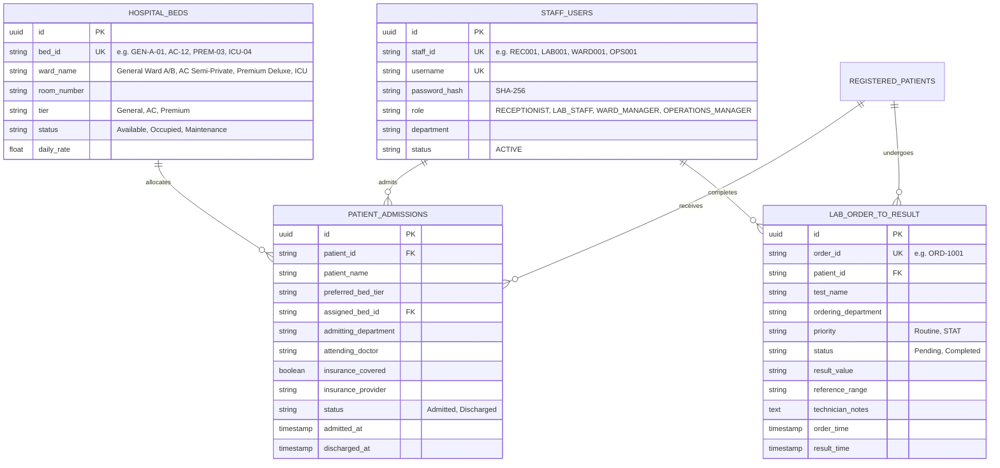

# 🗄️ Supabase Database Architecture & Relationships

## Entity-Relationship Overview

All Staff Operations data is stored centrally in **Supabase PostgreSQL**.

---

## 🔒 Foreign Key Constraints & Data Invariants

1. **Bed Allocation Invariant**: A bed with status `Occupied` cannot be assigned to another patient until an explicit discharge transaction occurs.
2. **Quota Invariant**: An admission transaction is rejected with `400 BED_QUOTA_FULL` if all beds in the requested category are occupied.
3. **Audit Trail Invariant**: Discharging a patient does not delete the admission record; it updates `status = 'Discharged'` and records `discharged_at`.
