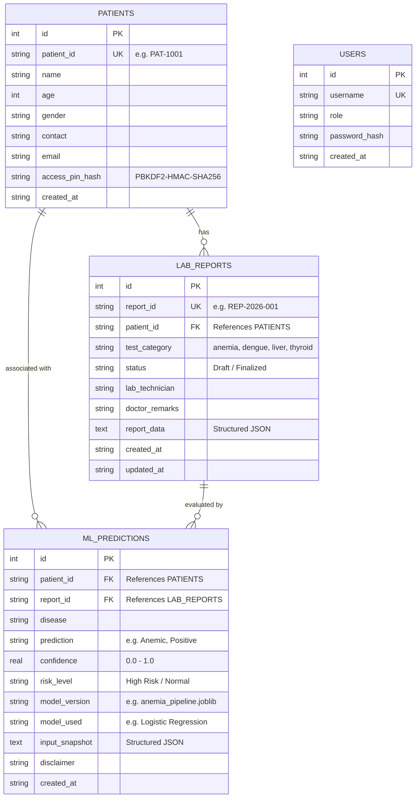

# Entity-Relationship (ER) Diagram

The following diagram illustrates the relational schema and cardinality of the **Nexus Pathology** database.

---

## Relationship Cardinality & Constraints

1. **`patients` $\leftrightarrow$ `lab_reports` (1 : N):**
   * One patient can have zero, one, or multiple laboratory reports over time.
   * Every laboratory report must reference a valid `patient_id` via a foreign key constraint.
2. **`lab_reports` $\leftrightarrow$ `ml_predictions` (1 : N):**
   * One laboratory report can be evaluated multiple times by ML pipelines (e.g., following model updates or re-analysis).
   * Every ML prediction is strictly linked to the originating `report_id` and `patient_id`.
3. **`users` (Independent Entity):**
   * Manages staff authentication and role permissions without direct foreign-key coupling to clinical reports, preserving staff anonymity in patient-facing report views while logging technician names in `lab_reports.lab_technician`.
